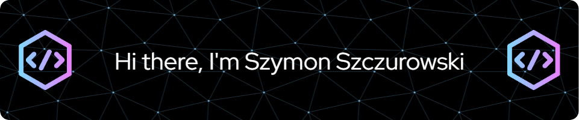

I am currently a second year computer science student at PJATK, Poland.
I direct my development towards both front-end and back-end. I enjoy learning new technologies and discovering new things.
I am currently focusing on front-end technologies and working on improving my skills in this area.

My goal is to become a skilled full-stack developer. I am always looking for new challenges and opportunities to learn and grow as a developer.

 
<b><h1>My favorite tools and technologies</h1></b>

   &nbsp;&nbsp;
   &nbsp;&nbsp;
   &nbsp;&nbsp;
   &nbsp;&nbsp;     
    &nbsp;&nbsp;
    &nbsp;&nbsp;     
    &nbsp;&nbsp;
    &nbsp;&nbsp;
    &nbsp;&nbsp;

  
        

